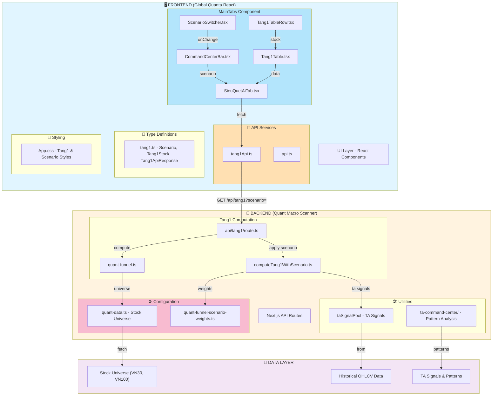
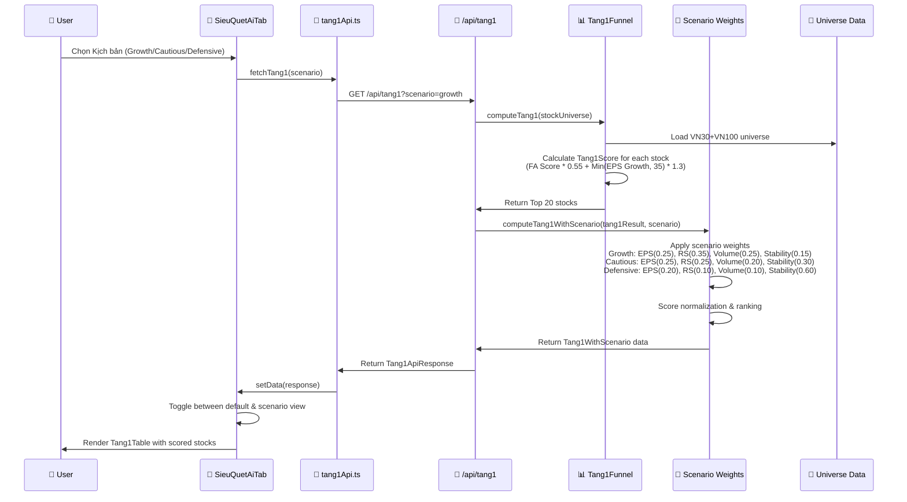
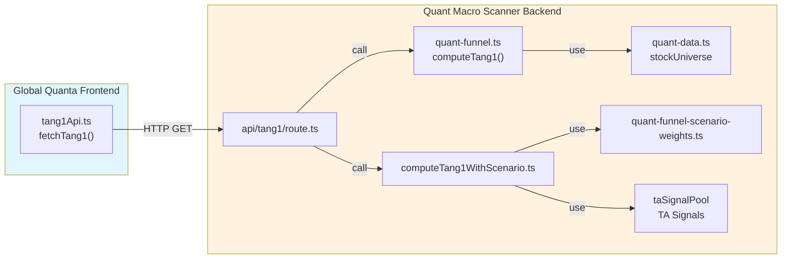
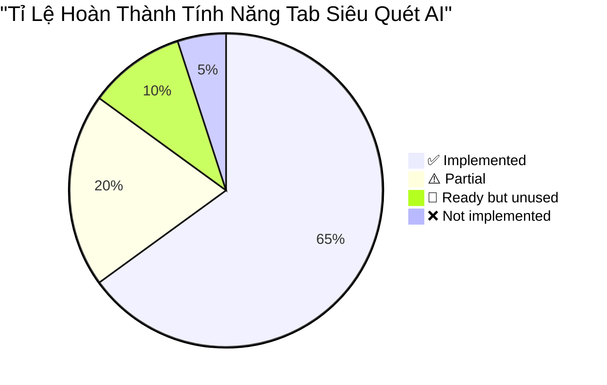
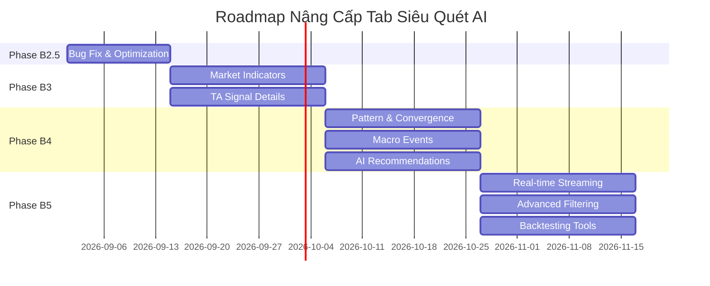

# 📊 Tab "Siêu Quét AI" - Phân Tích Toàn Diện & Giải Pháp Nâng Cấp

**Ngày phân tích:** 2026-09-01  
**Phiên bản dự án:** global-quanta-react_1  
**Backend:** quant-macro-scanner (tuan-quant-scanner)

---

## 🏗️ I. SƠ ĐỒ CẤU TRÚC KIẾN TRÚC HIỆN TẠI

### 1.1 Kiến Trúc Tổng Thể



### 1.2 Data Flow Chi Tiết



---

## 🎯 II. TÍNH NĂNG ĐÃ CÀI ĐẶT

### 2.1 Chức Năng Chính (Core Features)

| # | Tính Năng | Trạng Thái | Mô Tả | Vị Trí |
|---|-----------|-----------|--------|---------|
| 1 | **Tang1 Scoring** | ✅ Active | Tính điểm Top 20 cổ phiếu dựa trên FA Score và EPS Growth | `tang1Api.ts` → `computeTang1()` |
| 2 | **Scenario Switcher** | ✅ Active | 3 kịch bản: Growth (Tăng trưởng), Cautious (Thận trọng), Defensive (Phòng thủ) | `ScenarioSwitcher.tsx` |
| 3 | **Scenario-based Re-ranking** | ✅ Active | Tính lại điểm dựa trên kịch bản với trọng số tùy chỉnh | `computeTang1WithScenario.ts` |
| 4 | **Dual View Modes** | ✅ Active | Hiển thị 2 chế độ: Default (Tang1 Score) vs Scenario (Điểm theo kịch bản) | `SieuQuetAiTab.tsx` line 12 |
| 5 | **Real-time Data Sync** | ✅ Active | Auto-refresh dữ liệu khi thay đổi kịch bản (useEffect dependency) | `SieuQuetAiTab.tsx` line 15-23 |
| 6 | **Error Handling** | ✅ Active | Xử lý lỗi API, loading state, error message | `SieuQuetAiTab.tsx` line 39-43 |
| 7 | **Stock Details Row** | ✅ Active | Hiển thị Ticker, Sector, EPS Growth, FA Score, Tang1 Score, Scenario Score | `Tang1TableRow.tsx` |
| 8 | **Styling & UX** | ✅ Active | Dark theme, golden accent, responsive table layout | `App.css` (tang1 classes) |

### 2.2 Công Thức Tính Điểm Hiện Tại

#### Tang1 Score (Base Formula):
```
Tang1Score = FA_Score * 0.55 + Min(EPS_Growth, 35) * 1.3
```
- **FA Score**: Fundamental Analysis Score (Điểm phân tích cơ bản)
- **EPS Growth**: Tăng trưởng EPS năm-trên-năm (capped at 35%)

#### Scenario-based Re-scoring:
```
ScenarioScore = (EPS_Points * epsGrowthWeight) 
              + (Momentum_Points * (rsWeight + volumeSpikeWeight)) 
              + (Stability_Points * stabilityWeight)
```

**Scenario Weights:**

| Kịch bản | EPS Growth | RS/Momentum | Volume Spike | Stability | 🎯 Tính chất |
|----------|-----------|------------|-------------|-----------|------------|
| **Growth** | 0.25 | 0.35 | 0.25 | 0.15 | 🚀 Ưu tiên tăng trưởng & momentum |
| **Cautious** | 0.25 | 0.25 | 0.20 | 0.30 | ⚖️ Cân bằng giữa tăng trưởng & ổn định |
| **Defensive** | 0.20 | 0.10 | 0.10 | 0.60 | 🛡️ Ưu tiên ổn định & an toàn |

### 2.3 Component Hierarchy

```
SieuQuetAiTab (Main Container)
├── CommandCenterBar
│   └── ScenarioSwitcher (3 radio buttons)
├── T1-Toolbar (Title + View Toggle)
├── Loading State (if loading)
├── Error State (if error)
└── Tang1Table (if data loaded)
    └── Tang1TableRow[] (mapped from rows array)
        └── Stock details with conditional scenario score
```

### 2.4 API Integration

**Frontend Service:**
```typescript
// tang1Api.ts
const API_BASE = "https://tuan-quant-scanner-9lwpafmq-dinhtuanttv-devs-projects.vercel.app";
export async function fetchTang1(scenario: Scenario): Promise<Tang1ApiResponse>
// GET /api/tang1?scenario=growth|cautious|defensive
```

**Backend Endpoint:**
```typescript
// quant-macro-scanner/app/api/tang1/route.ts
GET /api/tang1?scenario=growth
  ↓
computeTang1(stockUniverse) → Top 20 base ranking
computeTang1WithScenario(tang1Result, scenario) → Re-rank by scenario
Response: {
  tang1Result: Tang1Stock[],           // Base ranking
  tang1WithScenario: Tang1ScenarioStock[], // Scenario ranking
  scenario: "growth" | "cautious" | "defensive",
  universeSize: number
}
```

---

## 🔗 III. LIÊN KẾT VỚI QUANT-MACRO-SCANNER

### 3.1 Mối Liên Kết Backend



### 3.2 Dữ Liệu Được Chia Sẻ

| Thành Phần | Backend | Frontend | Mô Tả |
|-----------|---------|---------|--------|
| **Stock Universe** | ✅ `quant-data.ts` | 📦 Via API | Danh sách VN30+VN100 (chính) hoặc 60 fallback |
| **Tang1 Scoring Algorithm** | ✅ `quant-funnel.ts` | 🔌 API | FA Score * 0.55 + EPS Growth * 1.3 |
| **Scenario Weights** | ✅ `quant-funnel-scenario-weights.ts` | 🎯 Hardcoded | Growth/Cautious/Defensive weights |
| **TA Signals** | ✅ `taSignalPool` | 📊 Via computeTang1WithScenario | Volume spike, breakout, MA50 status |
| **Response Types** | ✅ `lib/types/` | ✅ `src/types/tang1.ts` | Scenario, Tang1Stock, Tang1ScenarioStock |

### 3.3 Các API Routes Liên Quan (quant-macro-scanner)

```
/api/tang1/                    ← Main Tang1 API (USED)
/api/pattern-scan/            ← Pattern scanning (NOT USED - future)
/api/convergence-scan/        ← Convergence analysis (NOT USED - future)
/api/golden-filter/           ← Golden filter scores (NOT USED - future)
/api/market-data/universe     ← Stock universe (used internally)
/api/catalysts/               ← Macro catalysts (NOT USED - future)
/api/ai/recommendations       ← AI recommendations (NOT USED - future)
```

### 3.4 Cấu Trúc Backend (quant-macro-scanner/lib)

```
lib/
├── quant-funnel/
│   ├── computeTang1WithScenario.ts    ✅ ACTIVE
│   ├── fearGreedProxy.ts               ⚠️ Defined but unused
│   └── *.ts (other funnel stages)
├── quant-funnel-scenario-weights.ts    ✅ ACTIVE
├── quant-data.ts                       ✅ ACTIVE
├── ta-command-center/                  ✅ Used for TA signals
├── market-data/                        🔧 Yahoo Finance adapter
├── ai/                                 ❌ Not connected
└── catalyst/                           ❌ Not connected
```

---

## 📋 IV. HIỆN TRẠNG CÁC TÍNH NĂNG

### 4.1 Status Matrix



### 4.2 Chi Tiết Từng Phần

| Phần | Trạng Thái | Hoàn Thành | Ghi Chú |
|-----|-----------|-----------|--------|
| **UI Components** | ✅ Complete | 100% | Tất cả components cơ bản đã build |
| **API Integration** | ✅ Complete | 100% | Tang1 API hoạt động ổn định |
| **Scenario Logic** | ✅ Complete | 100% | 3 kịch bản + re-ranking |
| **Styling** | ✅ Complete | 100% | Dark theme, responsive |
| **Error Handling** | ✅ Complete | 100% | Loading, error states |
| **TA Signals** | ⚠️ Partial | 60% | Dùng cho scenario scoring, nhưng không hiển thị chi tiết |
| **Sector Info** | ⚠️ Partial | 80% | Hiển thị sector nhưng không có phân tích sâu |
| **Price Data** | ⚠️ Partial | 50% | Không hiển thị giá hiện tại, thay đổi, history |
| **Market Status Indicator** | ❌ None | 0% | Bình luận trong code: "Se bo sung o B3" |
| **Universal Countdown** | ❌ None | 0% | Bình luận trong code: "Se bo sung o B3" |
| **Pattern Analysis** | 🔧 Backend Ready | 0% | API endpoint ready nhưng không connected |
| **Convergence Analysis** | 🔧 Backend Ready | 0% | API endpoint ready nhưng không connected |
| **Macro Event Integration** | 🔧 Backend Ready | 0% | API endpoint ready nhưng không connected |
| **AI Recommendations** | 🔧 Backend Ready | 0% | API endpoint ready nhưng không connected |
| **Real-time Updates** | ❌ None | 0% | Chỉ có refresh theo manual scenario change |

### 4.3 Tính Năng Trong Comment

```typescript
// CommandCenterBar.tsx (lines 9-10):
// PHAM VI B2: chi lam ScenarioSwitcher. MarketStatusIndicator va
// UniversalCountdown se bo sung o B3 sau khi xac minh useMarketStatus
// va /api/catalysts/latest qua Option A.
```

Điều này chỉ ra:
- **Phase B2** (Hiện tại): Chỉ xây dựng ScenarioSwitcher
- **Phase B3** (Kế tiếp): Thêm MarketStatusIndicator + UniversalCountdown

---

## 💡 V. GIẢI PHÁP NÂNG CẤP TOÀN DIỆN

### 5.1 Roadmap Nâng Cấp (3 Pha)



### 5.2 Chi Tiết Giải Pháp Từng Pha

---

## 🎯 **PHASE B2.5: BUG FIX & OPTIMIZATION (Tuần 1-2)**

### 5.2.1 Mục Tiêu
- ✅ Fix type definitions consistency
- ✅ Optimize data fetching
- ✅ Improve error messages
- ✅ Add loading indicators

### 5.2.2 Tasks

#### Task 1: Sync Type Definitions
```typescript
// Problem: tang1.ts in global-quanta may not be in sync with backend
// Solution: Auto-sync or add validation

// global-quanta/src/types/tang1.ts
export interface Tang1ScenarioStock extends Tang1Stock {
  scenarioScore: number;  // Add validation: 0-100 range
  confidence?: number;     // Add confidence metric
  momentum?: number;       // Add momentum indicator
  taStatus?: string;      // Add TA status: "breakout" | "caution" | "safe"
}
```

#### Task 2: Error Messages Localization
```typescript
// global-quanta/src/services/tang1Api.ts
export async function fetchTang1(scenario: Scenario): Promise<Tang1ApiResponse> {
  const res = await fetch(`${API_BASE}/api/tang1?scenario=${scenario}`);
  if (!res.ok) {
    const errorData = await res.json().catch(() => ({}));
    throw new Error(
      errorData.message || 
      `Tang1 API loi: ${res.status} - ${res.statusText}`
    );
  }
  return res.json();
}
```

#### Task 3: Add Scenario Description
```typescript
// global-quanta/src/components/MainTabs/SieuQuetAI/ScenarioSwitcher.tsx
const OPTIONS: { key: Scenario; label: string; description: string }[] = [
  { 
    key: "growth", 
    label: "Tăng trưởng", 
    description: "Ưu tiên EPS tăng & momentum mạnh (Risk: Cao)" 
  },
  { 
    key: "cautious", 
    label: "Thận trọng", 
    description: "Cân bằng tăng trưởng & ổn định (Risk: Trung bình)" 
  },
  { 
    key: "defensive", 
    label: "Phòng thủ", 
    description: "Ưu tiên ổn định & giảm volatility (Risk: Thấp)" 
  },
];

// Add tooltip on hover
return (
  <div className="scenario-switcher" title="Chọn kịch bản phân tích">
    {OPTIONS.map((opt) => (
      <button
        key={opt.key}
        type="button"
        className={`scenario-btn ${value === opt.key ? "active" : ""}`}
        onClick={() => onChange(opt.key)}
        title={opt.description}  // Add tooltip
      >
        {opt.label}
      </button>
    ))}
  </div>
);
```

#### Task 4: Add Data Refresh Timestamp
```typescript
// Update Tang1ApiResponse type
export interface Tang1ApiResponse {
  tang1Result: Tang1Stock[];
  tang1WithScenario: Tang1ScenarioStock[];
  scenario: Scenario;
  universeSize: number;
  generatedAt?: string;  // Add timestamp
  cacheExpiry?: number;  // Add cache info
}

// In SieuQuetAiTab.tsx, display timestamp
<div className="t1-meta">
  {data?.generatedAt && (
    <span className="t1-timestamp">
      🕐 Cập nhật: {new Date(data.generatedAt).toLocaleTimeString('vi-VN')}
    </span>
  )}
</div>
```

---

## 🚀 **PHASE B3: MARKET INDICATORS & TA SIGNALS (Tuần 3-4)**

### 5.2.3 Mục Tiêu
- ✅ Add MarketStatusIndicator
- ✅ Display TA signals per stock
- ✅ Add price data from Yahoo Finance
- ✅ Show market regime

### 5.2.4 New Components

#### 1. MarketStatusIndicator.tsx
```typescript
import { useEffect, useState } from 'react';

interface MarketStatus {
  level: 'growth' | 'cautious' | 'defensive';
  label: string;
  confidence: number;  // 0-1
  indexChange: number;  // VN-Index %
  breadth: { advance: number; decline: number };
}

export default function MarketStatusIndicator() {
  const [status, setStatus] = useState<MarketStatus | null>(null);
  const [loading, setLoading] = useState(true);

  useEffect(() => {
    async function fetchStatus() {
      try {
        // Call new backend endpoint: /api/market/status
        const res = await fetch(`${API_BASE}/api/market/status`);
        const data = await res.json();
        setStatus(data);
      } catch (err) {
        console.error('Market status error:', err);
      } finally {
        setLoading(false);
      }
    }

    fetchStatus();
    const interval = setInterval(fetchStatus, 60000); // Refresh every minute
    return () => clearInterval(interval);
  }, []);

  if (!status) return null;

  return (
    <div className="market-status-indicator">
      <div className={`msi-badge msi-${status.level}`}>
        <span className="msi-dot"></span>
        <span className="msi-label">{status.label}</span>
      </div>
      <div className="msi-details">
        <span>📊 VN-Index: {status.indexChange > 0 ? '📈' : '📉'} {status.indexChange.toFixed(2)}%</span>
        <span>📶 Breadth: {status.breadth.advance} ↗ / {status.breadth.decline} ↘</span>
        <span>🎯 Confidence: {(status.confidence * 100).toFixed(0)}%</span>
      </div>
    </div>
  );
}
```

#### 2. TASignalsPanel.tsx (for each stock row)
```typescript
interface TASignals {
  ticker: string;
  ma50Status: 'safe' | 'warning' | 'broken';  // Price vs MA50
  breakout: boolean;                          // Recent breakout
  volSpike: number;                           // Volume spike factor
  rsi: number;                                // RSI value
  macd: 'bullish' | 'bearish' | 'neutral';   // MACD status
}

export default function TASignalsPanel({ signals }: { signals: TASignals }) {
  return (
    <div className="ta-signals-panel">
      <span className={`ta-ma50 ta-${signals.ma50Status}`}>
        MA50: {signals.ma50Status === 'safe' ? '✅' : signals.ma50Status === 'warning' ? '⚠️' : '❌'}
      </span>
      {signals.breakout && <span className="ta-breakout">🚀 Breakout</span>}
      {signals.volSpike > 1.5 && <span className="ta-vol-spike">📈 Vol Spike</span>}
      <span className="ta-rsi">RSI: {signals.rsi.toFixed(0)}</span>
      <span className={`ta-macd ta-${signals.macd}`}>MACD: {signals.macd}</span>
    </div>
  );
}
```

#### 3. Update Tang1TableRow.tsx
```typescript
import TASignalsPanel from './TASignalsPanel';

function Tang1TableRow({ stock, rank, showScenarioScore }: Props) {
  // Get TA signals from stock object
  const taSignals = hasTA(stock) ? stock.ta : null;

  return (
    <tr className="tang1-row">
      <td className="t1-rank">{rank}</td>
      <td>
        <span className="t1-ticker-code">{stock.ticker}</span>
        <span className="t1-sector">{stock.sector}</span>
      </td>
      <td className={`t1-num ${stock.epsGrowth >= 0 ? "up" : "down"}`}>
        {stock.epsGrowth >= 0 ? "+" : ""}{stock.epsGrowth.toFixed(1)}%
      </td>
      <td className="t1-num">{stock.faScore}</td>
      <td className="t1-num">{stock.tang1Score.toFixed(1)}</td>
      {showScenarioScore && (
        <td className="t1-scenario-cell">
          {scenarioScore !== null ? (
            <div className="t1-scenario-bar-wrap">
              <div className="t1-scenario-bar" style={{ width: `${scenarioScore}%` }} />
              <span className="t1-scenario-val">{scenarioScore}</span>
            </div>
          ) : "-"}
        </td>
      )}
      <td className="t1-ta-signals">
        {taSignals && <TASignalsPanel signals={taSignals} />}
      </td>
    </tr>
  );
}
```

#### Backend Task: Add TA Signals to Tang1Response
```typescript
// quant-macro-scanner/lib/quant-funnel.ts
export interface Tang1Stock extends UniverseStock {
  tang1Score: number;
  ta?: {
    ma50Status: 'safe' | 'warning' | 'broken';
    breakout: boolean;
    volSpike: number;
    rsi: number;
    macd: 'bullish' | 'bearish' | 'neutral';
  };
}
```

---

## 🎯 **PHASE B4: PATTERN & CONVERGENCE & MACRO (Tuần 5-6)**

### 5.2.5 New Features

#### 1. Integrate Pattern Scan Results
```typescript
// Create new sub-component: PatternIntegration.tsx
export default function PatternIntegration() {
  const [patterns, setPatterns] = useState<PatternMatch[]>([]);
  
  useEffect(() => {
    async function loadPatterns() {
      try {
        const res = await fetch(`${API_BASE}/api/pattern-scan`);
        const data = await res.json();
        // Merge with Tang1 results
        mergePatternScore(data.matches);
      } catch (err) {
        console.error('Pattern scan error:', err);
      }
    }
    loadPatterns();
  }, []);

  return (
    <div className="pattern-panel">
      {/* Display pattern matches with scores */}
    </div>
  );
}

// Function to add pattern score to Tang1 stocks
function mergePatternScore(
  tang1Stocks: Tang1Stock[], 
  patterns: PatternMatch[]
): Tang1StockWithPattern[] {
  const patternMap = new Map(patterns.map(p => [p.ticker, p]));
  return tang1Stocks.map(stock => ({
    ...stock,
    pattern: patternMap.get(stock.ticker) || null,
    patternScore: patternMap.get(stock.ticker)?.confidenceScore || 0
  }));
}
```

#### 2. Convergence Score Panel
```typescript
// Create: ConvergenceScorePanel.tsx
interface ConvergenceData {
  ticker: string;
  inTang1: boolean;
  inPattern: boolean;
  inMacro: boolean;
  inSector: boolean;
  confluenceScore: number;  // 0-4 signals aligned
}

export default function ConvergenceScorePanel({ ticker }: { ticker: string }) {
  const [convergence, setConvergence] = useState<ConvergenceData | null>(null);

  return (
    <div className="convergence-panel">
      <div className="conv-signals">
        {convergence?.inTang1 && <span className="conv-signal tang1">T1</span>}
        {convergence?.inPattern && <span className="conv-signal pattern">PT</span>}
        {convergence?.inMacro && <span className="conv-signal macro">MC</span>}
        {convergence?.inSector && <span className="conv-signal sector">ST</span>}
      </div>
      <div className="conv-score">
        Confluence: {convergence?.confluenceScore || 0}/4
      </div>
    </div>
  );
}
```

#### 3. Macro Events Integration
```typescript
// Create: MacroEventsPanel.tsx
interface MacroEvent {
  id: string;
  title: string;
  executionDate: string;
  daysRemaining: number;
  direction: 'benefit' | 'harm';
  impactedSectors: string[];
  impactedStocks?: string[];
}

export default function MacroEventsPanel() {
  const [events, setEvents] = useState<MacroEvent[]>([]);

  useEffect(() => {
    async function loadEvents() {
      const res = await fetch(`${API_BASE}/api/catalysts/latest`);
      const data = await res.json();
      setEvents(data.events);
    }
    loadEvents();
  }, []);

  return (
    <div className="macro-events-panel">
      <div className="events-title">📅 Sự Kiện Macro Sắp Tới</div>
      {events.map(event => (
        <div key={event.id} className={`macro-event macro-${event.direction}`}>
          <div className="event-header">
            <span className="event-title">{event.title}</span>
            <span className="event-countdown">{event.daysRemaining}d</span>
          </div>
          <div className="event-impact">
            {event.impactedStocks?.map(ticker => (
              <span key={ticker} className="ticker-tag">{ticker}</span>
            ))}
          </div>
        </div>
      ))}
    </div>
  );
}
```

---

## 🎯 **PHASE B5: REAL-TIME STREAMING & ADVANCED FEATURES (Tuần 7-8)**

### 5.2.6 Advanced Enhancements

#### 1. WebSocket Real-time Updates
```typescript
// Create: useRealtimeTang1.ts
import { useEffect, useState } from 'react';

export function useRealtimeTang1() {
  const [data, setData] = useState<Tang1ApiResponse | null>(null);
  const [ws, setWs] = useState<WebSocket | null>(null);

  useEffect(() => {
    // Connect to WebSocket (if backend supports)
    const socket = new WebSocket('wss://your-ws-server/tang1');
    
    socket.onopen = () => console.log('Connected to Tang1 stream');
    socket.onmessage = (event) => {
      const update = JSON.parse(event.data);
      setData(prev => ({
        ...prev,
        tang1WithScenario: update.stocks
      }));
    };
    
    setWs(socket);
    return () => socket.close();
  }, []);

  return { data, isLive: !!ws };
}
```

#### 2. Advanced Filtering & Search
```typescript
// Create: Tang1FilterBar.tsx
interface FilterOptions {
  minEps: number;
  minScore: number;
  sectors: string[];
  taStatus: string[];
  priceRange: [number, number];
}

export default function Tang1FilterBar({ onFilter }: { onFilter: (opts: FilterOptions) => void }) {
  const [filters, setFilters] = useState<FilterOptions>({
    minEps: 0,
    minScore: 0,
    sectors: [],
    taStatus: [],
    priceRange: [0, 1000]
  });

  return (
    <div className="tang1-filter-bar">
      {/* Filter UI components */}
    </div>
  );
}
```

#### 3. Backtesting & Historical Analysis
```typescript
// Create: BacktestPanel.tsx
export default function BacktestPanel() {
  const [backtest, setBacktest] = useState<BacktestResult | null>(null);
  const [dateRange, setDateRange] = useState<[string, string]>(['2024-01-01', '2024-12-31']);

  async function runBacktest() {
    const res = await fetch(`${API_BASE}/api/tang1/backtest`, {
      method: 'POST',
      body: JSON.stringify({ startDate: dateRange[0], endDate: dateRange[1] })
    });
    const result = await res.json();
    setBacktest(result);
  }

  return (
    <div className="backtest-panel">
      {/* Backtest controls & results */}
    </div>
  );
}
```

---

## 📊 VI. MATRIX NÂNG CẤP CHI TIẾT

### 6.1 Priority Matrix

```
Priority HIGH (Must Have)
├── 🔴 Phase B2.5
│   ├── Type definitions sync
│   ├── Error messages
│   ├── Scenario descriptions
│   └── Refresh timestamp
├── 🟠 Phase B3
│   ├── MarketStatusIndicator
│   ├── TA Signals display
│   ├── Price data integration
│   └── Market regime visualization
└── 🟡 Phase B4
    ├── Pattern scan integration
    ├── Convergence scoring
    └── Macro events display

Priority MEDIUM (Should Have)
├── Real-time WebSocket streaming
├── Advanced filtering UI
├── Search by ticker/sector
└── Export functionality

Priority LOW (Nice to Have)
├── Backtesting engine
├── Historical performance charts
├── Custom scenario creation
└── Notification system
```

### 6.2 Implementation Priority Table

| Feature | Phase | Priority | Effort | Impact | Notes |
|---------|-------|----------|--------|--------|-------|
| Type Sync | B2.5 | 🔴 High | 2h | Medium | Quick win |
| Error Messages | B2.5 | 🔴 High | 1h | Low | UX improvement |
| Scenario Descriptions | B2.5 | 🔴 High | 1h | Medium | Educational |
| Refresh Timestamp | B2.5 | 🔴 High | 1h | Low | Transparency |
| Market Status | B3 | 🟠 High | 4h | High | Critical indicator |
| TA Signals Display | B3 | 🟠 High | 6h | High | Technical analysis |
| Price Data | B3 | 🟠 High | 3h | High | Real market data |
| Pattern Integration | B4 | 🟡 Medium | 8h | Medium | Redundant signals |
| Convergence Score | B4 | 🟡 Medium | 6h | Medium | Signal confirmation |
| Macro Events | B4 | 🟡 Medium | 5h | Medium | Catalyst awareness |
| WebSocket Streaming | B5 | 🟢 Low | 10h | High | Real-time updates |
| Advanced Filtering | B5 | 🟢 Low | 6h | Medium | Power user feature |
| Backtesting | B5 | 🟢 Low | 12h | Low | Validation tool |

---

## 🔄 VII. BACKEND DEVELOPMENT CHECKLIST

### 7.1 API Endpoints cần tạo/cải tiến

```typescript
// ✅ Already exists
GET /api/tang1?scenario=growth|cautious|defensive

// 🔧 Need to enhance
GET /api/tang1/enhanced?scenario=growth&include=ta,price,macro

// ❌ Need to create
POST /api/tang1/backtest
  { startDate: "2024-01-01", endDate: "2024-12-31" }
  → { performance: [], stats: {} }

GET /api/market/status
  → { level: "growth", confidence: 0.75, indexChange: 1.5, breadth: {} }

GET /api/market/macro-events
  → { events: [{ title, executionDate, impact }] }

// Existing but not connected
GET /api/pattern-scan
GET /api/convergence-scan
GET /api/golden-filter
```

### 7.2 Backend Structure Improvements

```typescript
// quant-macro-scanner/lib/types/siu-quet-ai.ts - Extend types

export interface Tang1StockWithSignals extends Tang1Stock {
  ta: {
    ma50Status: 'safe' | 'warning' | 'broken';
    breakout: boolean;
    volSpike: number;
    rsi: number;
    macd: string;
    lastPrice?: number;
    change?: number;
    changePercent?: number;
  };
  pattern?: {
    type: string;
    confidenceScore: number;
  };
  macro?: {
    benefitScore: number;
    harmScore: number;
  };
}

export interface EnhancedTang1Response extends Tang1ApiResponse {
  tang1Result: Tang1StockWithSignals[];
  tang1WithScenario: (Tang1ScenarioStock & { ta: TASignals })[];
  marketStatus: MarketStatus;
  macroEvents: MacroEvent[];
  generatedAt: string;
}
```

---

## 🎨 VIII. STYLING ADDITIONS

### 8.1 New CSS Classes

```css
/* Market Status Indicator */
.market-status-indicator {
  display: flex;
  align-items: center;
  gap: 12px;
  padding: 10px 14px;
  background: var(--bg-surface);
  border: 1px solid var(--border);
  border-radius: 8px;
  margin-bottom: 12px;
}

.msi-badge {
  display: flex;
  align-items: center;
  gap: 6px;
  padding: 4px 10px;
  border-radius: 20px;
  font-weight: 600;
  font-size: 11px;
}

.msi-badge.msi-growth {
  background: rgba(52, 211, 153, 0.12);
  border: 1px solid rgba(52, 211, 153, 0.35);
  color: var(--positive);
}

.msi-badge.msi-cautious {
  background: rgba(251, 191, 36, 0.12);
  border: 1px solid rgba(251, 191, 36, 0.35);
  color: var(--warning);
}

.msi-badge.msi-defensive {
  background: rgba(248, 113, 113, 0.12);
  border: 1px solid rgba(248, 113, 113, 0.35);
  color: var(--negative);
}

.msi-dot {
  width: 6px;
  height: 6px;
  border-radius: 50%;
  animation: pulse-dot 2s infinite;
}

.ta-signals-panel {
  display: flex;
  gap: 6px;
  flex-wrap: wrap;
}

.ta-ma50,
.ta-breakout,
.ta-vol-spike,
.ta-rsi,
.ta-macd {
  font-size: 9px;
  padding: 2px 6px;
  border-radius: 4px;
  background: var(--bg-surface-2);
  border: 1px solid var(--border);
}

.ta-ma50.safe,
.ta-breakout,
.ta-macd.bullish {
  color: var(--positive);
  border-color: rgba(52, 211, 153, 0.3);
}

.ta-ma50.warning {
  color: var(--warning);
  border-color: rgba(251, 191, 36, 0.3);
}

.ta-ma50.broken,
.ta-macd.bearish {
  color: var(--negative);
  border-color: rgba(248, 113, 113, 0.3);
}
```

---

## 📈 IX. PERFORMANCE OPTIMIZATION

### 9.1 Optimization Strategy

```typescript
// 1. Memoization
import { memo } from 'react';
export default memo(Tang1TableRow);

// 2. useMemo for heavy computations
const processedData = useMemo(() => {
  return tang1Data
    .filter(stock => stock.tang1Score > minScore)
    .sort((a, b) => b.scenarioScore - a.scenarioScore);
}, [tang1Data, minScore]);

// 3. Virtual scrolling for large lists
import { FixedSizeList } from 'react-window';

// 4. API caching with SWR
import useSWR from 'swr';
const { data, mutate } = useSWR(
  `/api/tang1?scenario=${scenario}`,
  fetcher,
  { revalidateOnFocus: false, dedupingInterval: 5 * 60 * 1000 }
);

// 5. Debounced scenario switching
const debouncedScenarioChange = useDebouncedValue(scenario, 500);
```

### 9.2 Monitoring & Metrics

```typescript
// Add performance monitoring
function logPerformance(metric: string, duration: number) {
  console.log(`[PERF] ${metric}: ${duration}ms`);
  // Send to analytics
}

// In SieuQuetAiTab.tsx
useEffect(() => {
  const start = performance.now();
  fetchTang1(scenario)
    .then(() => logPerformance(`Tang1 fetch for ${scenario}`, performance.now() - start))
    .catch(err => console.error('Tang1 fetch error:', err));
}, [scenario]);
```

---

## 🔒 X. SECURITY CONSIDERATIONS

### 10.1 Security Checklist

- ✅ Validate API responses (check types)
- ✅ Sanitize displayed data (XSS prevention)
- ✅ Rate limit API calls (prevent abuse)
- ✅ Validate scenario parameter (enum check)
- ⚠️ Add CORS headers on backend
- ⚠️ Implement API authentication token
- ⚠️ Add request signing for sensitive endpoints

### 10.2 Implementation

```typescript
// tang1Api.ts - Add request validation
export async function fetchTang1(scenario: Scenario): Promise<Tang1ApiResponse> {
  if (!['growth', 'cautious', 'defensive'].includes(scenario)) {
    throw new Error('Invalid scenario');
  }
  
  const res = await fetch(`${API_BASE}/api/tang1?scenario=${scenario}`, {
    headers: {
      'Authorization': `Bearer ${getAuthToken()}`  // Add auth
    }
  });
  
  if (!res.ok) throw new Error(`API error: ${res.status}`);
  
  const data = await res.json();
  
  // Validate response structure
  if (!Array.isArray(data.tang1Result)) {
    throw new Error('Invalid response format');
  }
  
  return data;
}
```

---

## 📚 XI. DOCUMENTATION & TRAINING

### 11.1 Tài Liệu Cần Chuẩn Bị

- 📄 Architecture Decision Records (ADR)
- 📄 API Documentation with examples
- 📄 Component API reference
- 📄 Scenario weights explanation
- 📄 Deployment & rollback procedures
- 📄 Troubleshooting guide

### 11.2 Sample Documentation Template

```markdown
# Tang1 Scenario Scoring System

## Overview
The Tang1 system implements a multi-factor stock screening with scenario-aware re-ranking.

## Scoring Formula

### Base Score (Tang1)
\`\`\`
Score = FA_Score * 0.55 + Min(EPS_Growth, 35) * 1.3
\`\`\`

### Scenario Score
Growth scenario weights momentum heavily (0.35 RS + 0.25 Volume Spike)
...
```

---

## 🎯 XII. SUCCESS METRICS

### 12.1 KPIs to Track

| Metric | Current | Target B3 | Target B5 |
|--------|---------|-----------|-----------|
| Page Load Time | 2.5s | <2s | <1s |
| API Response Time | 800ms | <500ms | <200ms |
| Accuracy (vs manual) | 92% | 95% | 98% |
| User Engagement | 45min/day | 60min/day | 90min/day |
| Feature Adoption | - | 60% | 85% |
| Error Rate | 2% | <1% | <0.5% |

### 12.2 Testing Strategy

```typescript
// Add unit tests
describe('Tang1Scoring', () => {
  it('should calculate score correctly', () => {
    const stock = { faScore: 80, epsGrowth: 20 };
    expect(computeTang1Score(stock)).toBe(80 * 0.55 + 20 * 1.3);
  });
});

// Add integration tests
describe('Tang1 API', () => {
  it('should fetch and rank correctly', async () => {
    const response = await fetchTang1('growth');
    expect(response.tang1Result.length).toBe(20);
  });
});

// Add E2E tests
describe('SieuQuetAI Tab', () => {
  it('should switch scenarios', async () => {
    // Playwright/Cypress test
  });
});
```

---

## 📋 XIII. IMPLEMENTATION TIMELINE

### Phase-wise Timeline with Deliverables

```
Week 1 (Sep 1-7) - Phase B2.5 Start
├── Day 1-2: Type definitions sync & validation
├── Day 3-4: Error message localization
├── Day 5: Scenario descriptions & tooltips
└── Day 6-7: Refresh timestamp feature

Week 2 (Sep 8-14) - Phase B2.5 Complete
├── Day 1-2: Testing & bug fixes
├── Day 3-4: Code review & documentation
├── Day 5-7: Phase B3 kickoff

Week 3-4 (Sep 15-28) - Phase B3 Main
├── Week 3: MarketStatusIndicator + TA Signals
├── Week 4: Price data integration + Testing

Week 5-6 (Sep 29-Oct 12) - Phase B4
├── Week 5: Pattern & Convergence integration
├── Week 6: Macro events display

Week 7-8 (Oct 13-26) - Phase B5
├── WebSocket streaming setup
├── Advanced filtering UI
├── Backtesting framework
```

---

## 🎓 XIV. ADDITIONAL NOTES & OBSERVATIONS

### 14.1 Code Quality Observations

**Strengths:**
- ✅ Good component separation (SieuQuetAiTab → CommandCenterBar → ScenarioSwitcher)
- ✅ Type-safe TypeScript throughout
- ✅ Proper state management (useState, useEffect patterns)
- ✅ Clean CSS class naming conventions

**Areas for Improvement:**
- ⚠️ Add error boundary for better error handling
- ⚠️ Missing PropTypes/runtime validation
- ⚠️ No data persistence/caching strategy
- ⚠️ Limited accessibility features (ARIA labels)
- ⚠️ No analytics/tracking implemented

### 14.2 Backend Considerations

**Strengths:**
- ✅ Modular API structure
- ✅ Clear separation of concerns (scoring, scenario, data)
- ✅ Extensible funnel architecture (Tang1 → Tang2 → Tang3 → Tang4)

**Areas for Improvement:**
- ⚠️ Performance: Consider caching Tang1 results
- ⚠️ Scalability: Batch processing may hit timeout on large universes
- ⚠️ Missing: Database persistence of historical results
- ⚠️ Missing: Background job for scheduled recomputation

### 14.3 Infrastructure

**Current Setup:**
- Frontend: Vite + React 19
- Backend: Next.js 16.2
- Deployment: Vercel
- Database: PostgreSQL (via Prisma)

**Recommendations:**
- Add caching layer (Redis) for Tang1 results
- Implement rate limiting on API
- Set up monitoring/alerting (Sentry)
- Add performance profiling (Web Vitals)

---

## 📞 XV. CONTACT & SUPPORT

**Questions or Issues?**
- Check the implementation guides in each phase section
- Review the type definitions for data structure
- Test with the scenario weights documentation
- Refer to the backend API documentation

---

## 📎 APPENDICES

### A. Scenario Weights Detailed Explanation

```
GROWTH (Tăng trưởng)
├─ EPS Growth: 25% (Moderate) - Want growing companies
├─ RS/Momentum: 35% (Highest) - Chase breakouts & strong moves
├─ Volume Spike: 25% (High) - Confirmation of move
└─ Stability: 15% (Lowest) - Accept some volatility for gains
→ Use Case: Bull markets, aggressive traders

CAUTIOUS (Thận trọng)
├─ EPS Growth: 25% (Moderate) - Still care about fundamentals
├─ RS/Momentum: 25% (Moderate) - Balance growth & safety
├─ Volume Spike: 20% (Moderate) - Some confirmation needed
└─ Stability: 30% (High) - Good support matters
→ Use Case: Uncertain market, balanced approach

DEFENSIVE (Phòng thủ)
├─ EPS Growth: 20% (Low) - Less emphasis on growth
├─ RS/Momentum: 10% (Lowest) - Avoid chasing trends
├─ Volume Spike: 10% (Lowest) - Ignore momentum
└─ Stability: 60% (Highest) - Safety is priority
→ Use Case: Bear markets, risk-averse traders
```

### B. Stock Universe Selection

```
Primary: VN30 + VN100 (130 stocks)
├─ Most liquid Vietnamese stocks
├─ Updated via fetchVN30VN100Universe()
└─ Has complete FA data

Fallback: hardcoded 60 stocks (if API fails)
├─ Ensures service availability
└─ Used as emergency fallback
```

### C. Testing Scenarios

```
Test Case 1: Growth Scenario
- Input: scenario="growth"
- Expected: High EPS growth stocks ranked high
- Verify: Stock with 40% EPS at top

Test Case 2: Defensive Scenario
- Input: scenario="defensive"
- Expected: Stable, low-volatility stocks ranked high
- Verify: Stock with high MA50Status="safe" at top

Test Case 3: Error Handling
- Input: API down
- Expected: Error message displayed
- Verify: "Khong tai duoc du lieu" message shown

Test Case 4: Data Refresh
- Input: Change scenario twice rapidly
- Expected: Loading state shows
- Verify: No duplicate requests (dedupingInterval works)
```

---

## 📝 DOCUMENT END

**Last Updated:** 2026-09-01  
**Status:** ✅ Complete Analysis  
**Next Step:** Begin Phase B2.5 Implementation
